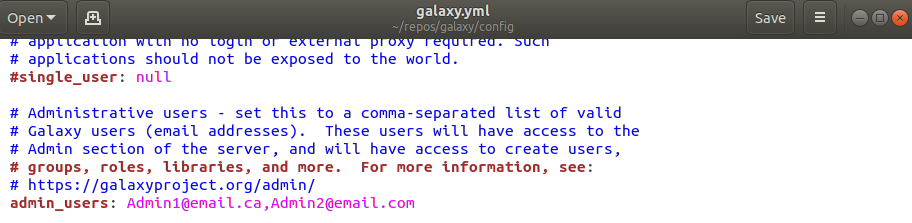
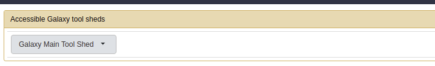
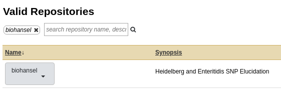

Galaxy
======

Installation Instructions for New Galaxy Users
----------------------------------------------

Requirements
############

- Unix/Linux or Mac OSX

- Python 2.7

Steps
#####

If you just want biohansel or other programs to run on your own instance of Galaxy, then follow the steps below to download and install Galaxy. If you wish to work on Galaxy development or use it for another purpose other then installing and running Bioinformatic tools, then read more about `Galaxys uses <https://galaxyproject.org/admin/get-galaxy/>`_.

For your own instance of Galaxy follow these steps:

1. Go to https://galaxyproject.org/admin/get-galaxy/ and for our purposes clone the latest release of Galaxy to a Git repository

.. code:: bash

    cd <repo directory>
    # Change to a directory you want to clone Galaxy to

    git clone -b release_18.09 https://github.com/galaxyproject/galaxy.git
    # As of writing this, the current release of Galaxy is Version 18.09
    # You can always update Galaxy or clone the master branch following the instructions
    # of the get-galaxy site

2. Galaxy will create config files once the server is run for the first time. Now start Galaxy with:

.. code:: bash

    cd galaxy
    # Move into the cloned galaxy directory

    sh run.sh
    # This will run galaxy for the first time should everything be correctly installed.
    # It will automatically create all necessary files

Once the start-up is finished, a Galaxy server on the local host will start. 

3. Galaxy can now be accessed from any web browser at http://localhost:8080 . After starting, Galaxy output will be printed to the terminal window from the created galaxy server. 

If any problems have occurred or you want to customize/modify settings, view the `Galaxy project's get Galaxy website <https://galaxyproject.org/admin/get-galaxy/>`_ for greater details and instructions.

4. Use ``Ctrl-C`` to shutdown Galaxy and then use the following command to add the sample config file:

.. code:: bash

    cp config/galaxy.yml.sample config/galaxy.yml

5. Become an Admin so that you may add tools.

    1. Register with your Galaxy through the register button at the top

    2. Give Admin-user privileges for your login email to the configuration file ``config/galaxy.yml``. Open the file and then under the admin_users: add a list of comma separated emails.
            - **Make sure to uncomment (remove the #) the admin_users line**

|admin_access|

6. Restart Galaxy on the terminal again with ``Ctrl-C`` and the start command:

.. code:: bash

    sh run.sh

7. Now to install biohansel, continue following along here or go to the Galaxy Admin tab at the top bar:

|admin_bar|

8. On the side bar locate install new tools and click on it to show the following page:

|install_new|

9. Click on the button and search the Valid Repositories for ``biohansel`` or ``bio_hansel``. Currently, biohansel is the more up to date version available but any Galaxy version can be found here.

|search|

10. Click on biohansel and a drop down menu will appear allowing you to preview/install. Click on this to be redirected to a page that will let you browse the repository for biohansel, or install it to Galaxy.

11. Once you click on *Install to Galaxy*, you will be brought to a page to confirm the installation and the location that the tool can be found under in the toolbar. Set these to your preferences and then click install.

12. Additional information on installing tools can be found on the `Galaxy website installing tools tutorial <https://galaxyproject.org/admin/tools/add-tool-from-toolshed-tutorial/>`_.

`link to biohansel repository <https://toolshed.g2.bx.psu.edu/view/nml/biohansel/ba6a0af656a6>`_

Installation Instructions for Galaxy Admins
-------------------------------------------

Follow along steps 7 - 11 of the previous section. 

For additional information, see the `Galaxy website installing tools tutorial <https://galaxyproject.org/admin/tools/add-tool-from-toolshed-tutorial/>`_.
