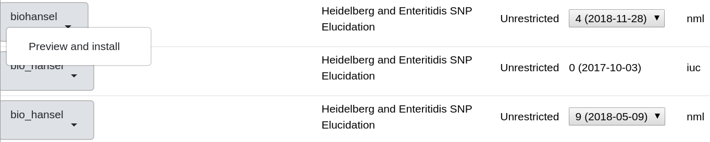

Versions
========

.. |valid_repo| image:: valid_repo.png
   :width: 300 px
   :alt: Shows where to click for the repos

.. |select_version| image:: select_version.png
   :width: 600 px
   :alt: Click here to get to the installation page to choose your version.

Galaxy versions
---------------

Using Galaxy, you can easily install older versions of BioHansel to your own Galaxy workspace. To do this, follow the `Galaxy Installation Page instructions <galaxy.html>`_ to get Galaxy to run on your local machine. Once Galaxy is installed and you make yourself an admin, you can install any other versions of BioHansel released to Galaxy with the following:

1. Click on the Admin button on the top bar to be brought to the Admin page.

2. On the Admin page, on the left side bar under "Tool Management", click on Install new tools to be brought to the "Accessible Galaxy tool sheds".

3. Once on this page, click the arrow on the "Galaxy Main Tool Shed" button and then click on the "Browse valid repositories" option.

|valid_repo|

4. Search the valid repos for ``biohansel`` or ``bio_hansel``. Each has different versions that can be installed.

- biohansel can install versions from 2018-11-05 to present

- bio_hansel can install versions from 2018-05-09 to 2017-09-27

Once you know what version you want, click on the "Preview and install" button after clicking the arrow on the biohansel button.

|preview_install|

5. Choose the version you wish to install with the drop down menu and then click "install to Galaxy" in the top left corner.

|select_version|

6. Confirm the installation and then the version of BioHansel specified will be installed into your local Galaxy

