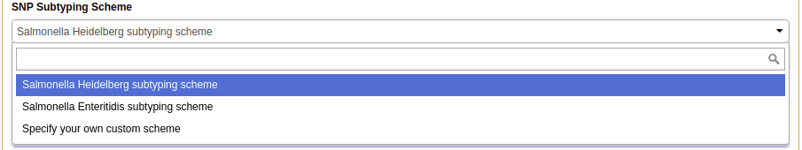
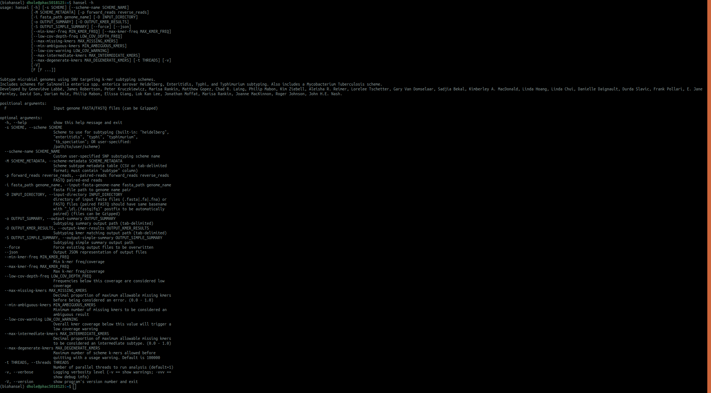
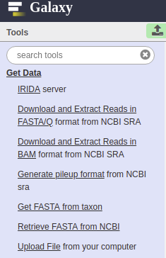
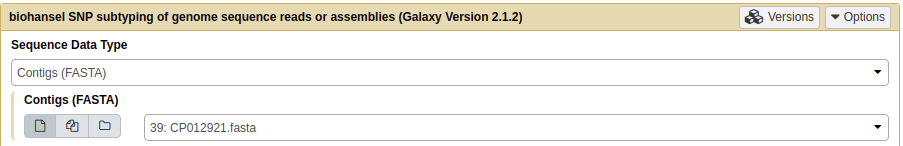
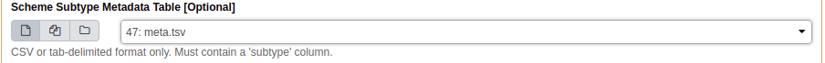
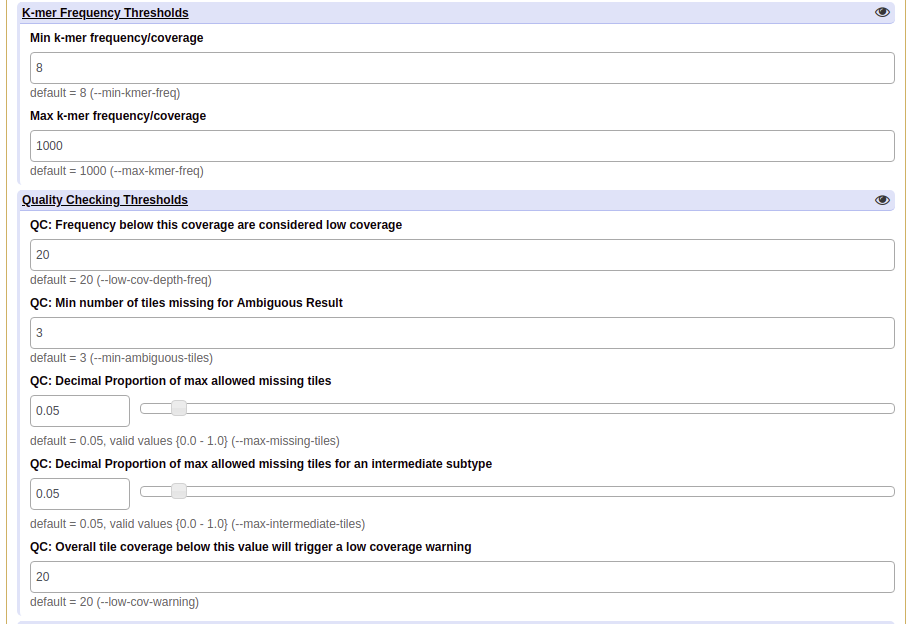
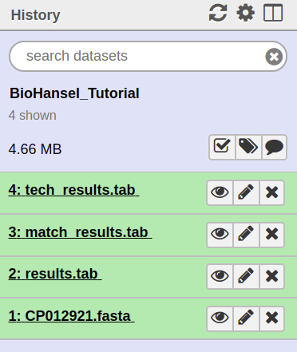

Tutorial
========

 
.. |experimental| image:: https://raw.githubusercontent.com/phac-nml/biohansel/readthedocs/docs/source/user-docs/Biohansel%20location.PNG
   :alt: location of biohansel in galaxy
   :width: 250 px
   
   
.. |fmatch| image:: https://raw.githubusercontent.com/phac-nml/biohansel/readthedocs/docs/source/user-docs/Match_results.PNG
   :alt: fasta match results
   :width: 670 px
   
.. |ftech| image:: https://raw.githubusercontent.com/phac-nml/biohansel/readthedocs/docs/source/user-docs/tech_results.PNG
   :alt: fasta tech results
   :width: 600 px
   
.. |fresults| image:: https://raw.githubusercontent.com/phac-nml/biohansel/readthedocs/docs/source/user-docs/Results.PNG
   :alt: fasta results
   :width: 900 px
   
   
.. |rmatch| image:: https://raw.githubusercontent.com/phac-nml/biohansel/readthedocs/docs/source/user-docs/Match%20results.PNG
   :alt: raw match
   :width: 600 px
   
   
.. |rresults| image:: https://raw.githubusercontent.com/phac-nml/biohansel/readthedocs/docs/source/user-docs/results.PNG
   :alt: raw results
   :width: 600 px
   
   
.. |rtech| image:: https://raw.githubusercontent.com/phac-nml/biohansel/readthedocs/docs/source/user-docs/Tech%20resultss.PNG
   :alt:  raw tech results
   :width: 600 px

This tutorial is for demonstrating how to run biohansel and to confirm that it is installed correctly.
For step by step installation instructions view `installation home <../installation-docs/home.html>`_ or
for quick instructions view `quick install <usage.html>`_.

Testing:
########

This page can be used to verify that biohansel is working properly with the different interfaces (command line/Galaxy):

To follow along:

Download either the CP012921.fasta (fasta file) or the SRR2598330(fastq-dump).fastqsanger.gz (raw file)
which are the same samples in different formats:

   <https://share.corefacility.ca/index.php/s/dRGOuqhDJUNeKmE> (password: biohansel)
   
CP012921.fasta - is an assembled sequence. 

SRR2598330 (fastq-dump).fastqsanger.gz - is the raw reads file that CP012921 was assembled from.

Specific steps regarding the testing/checking that installation was successful using the sample data found above will be found within the (brackets) below each general step involved in the analysis pipeline.

 **Both example files are from the same Salmonella Heidelberg sample**

NML - Galaxy Access (biohansel)
###############################

**1.** Create a new history in Galaxy and import either fasta files or raw reads files that are being analyzed into
the newly created history using any of the tools from the Get Data "Tools" section.

    (For verification: find the sample data in your files, most likely in Downloads, and upload it into Galaxy using the upload file tool.)

|getdata|
   

**2.** Find biohansel on the right-hand side in the "Tools" Section: Under the Experimental Section and click it.

  |experimental|

  
**3.** For the "Sequence Data Type" parameter, select the proper type of data (FASTA vs. FASTQ (raw)) depending upon
the type of data being analyzed

    (For Verification: If you are using the Fasta file select the fasta option. If you are using the FastQ file,
    select the paired-end reads data type.)
    
|sequencedata|

**4.** For the "SNP Subtyping Scheme", select the proper scheme corresponding to the organism in your samples.
This can currently be the included Heidelberg or Enteritidis schemes or a user created FASTA file

    (For verification: select the "Salmonella Heidelberg subtype scheme")
       
|heidelberg|

**5.** Optionally, add a Scheme Subtype Metadata Table to the analysis to be included into the end of
the results files. This file must be in the .tsv format to be added properly or the analysis may fail
(.csv may work on Galaxy but if the analysis fails change it to .tsv). 

|metadata|

**6.** Click on the eye (|eyes|) to expand or collapse the modifiable parameters to allow adjustments to
them to suit your needs. The defaults work well for most analyses but in some situations it may be beneficial
to change them. Detailed information on the parameters that Galaxy allows modification to and what they do can be
found in the `parameters section <parameters.html>`_

    (For verification: leave all of the parameters as their defaults.)

|options|
  

**7.** Execute your inputs and analyze your data by clicking the large execute button to produce three results files: tech_results.tab, match_results.tab and results.tab. 

The normal execution time is 0.5 - 60 seconds depending on what the inputs were. Don't be alarmed if it does take longer as it depends on the available computing power and the size of the dataset given (especially on Galaxy).

    (For verification: verify that the output was correct by comparing to the `Verification Results`_.)

**8.** The .tab files can be opened in excel or another spreadsheet program to view the results of the analysis. On Galaxy, the results can be looked at by clicking on the view data eye in the history section. 

|galaxyresults|

\**For more detailed information on the different types of outputs that are produced by biohansel go to: `Output <https://bio-hansel.readthedocs.io/en/readthedocs/user-docs/output.html>`_

Running biohansel on Terminal (MAC) using Conda
###############################################

Steps
-----

**1.** Go to `Quick Installation instructions <https://bio-hansel.readthedocs.io/en/readthedocs/user-docs/usage.html>`_ or
`Full installation instructions <../installation-docs/home.html>`_ (exact same with different details to them) and
download Miniconda from the website following the instructions corresponding to your given iOS.

**Skip to step 6 if you have already installed biohansel.**

**2.** After installing Conda, go on terminal and create a conda environment by inputing this command:

.. code-block:: bash

    conda create -n <name of environment> python=3.6

    # For example to create an environment called biohansel the command would be:
    conda create -n biohansel python=3.6

**3.** It will ask you to proceed (y/n) afterwards, type in: y

**4.** Then activate your environment by typing:

.. code-block:: bash

    source activate <name of your environment>

    # If you called your environment biohansel, the activate command would be:
    source activate biohansel

    # Source activate will activate the environment. You know that it is active if you see
    # the environment name beside your name.

**5.** Now install biohansel onto conda environment by inputting:

.. code-block:: bash

    conda install bio_hansel

    # Make sure to always activate the environment that biohansel was installed into 
    # otherwise it will not run.

**6.** To confirm that biohansel has been installed in the environment, input:

.. code-block:: bash

    hansel -h 
    #this command shows the numerous types of commands you can use in for biohansel

    # If there is any issue confirm that, if using conda, you are in the correct environment
    # that you installed biohansel to.

    # If you installed biohansel with pip and are having issues; confirm that biohansel
    # was installed into the correct python (Should be python 3.6 or higher) with the command:
    # which python

Additional troubleshooting can be found in the `installation page <../installation-docs/home.html>`_. Go to `command-line <https://bio-hansel.readthedocs.io/en/readthedocs/user-docs/command-line.html>`_ to see detailed descriptions of all of the arguments that can be used to run biohansel. Quick descriptions of the arguments_ are found below.

|command|

**Please click the image to view the command**

**7.** Figure out what directory you are in (which is most likely User/"*name of user*) using the following command:

.. code-block:: bash

    pwd
    # pwd = "print working directory" and will show which directory you are currently in.

**8.** Using the terminal window, change directories to the directory/folder that contains the data
that you want to analyze. This can be done with the following command:

.. code-block:: bash

    cd <path/to/file>
    
Example: if the file was in User/name of user/Downloads you input:

.. code-block:: bash

    cd User/name of user/Downloads
    # cd = change directory command

**9.** Once you're in the directory where your data is stored, biohansel can be used to analyze
the data in the directory using the following command:

.. code-block:: bash 

    hansel -s heidelberg -vv -o results.tab -O match_results.tab -S tech_results.tab <Name of data file>

    # If you downloaded the CP012921.fasta, then you would input CP012921.fasta at the end of the command
    # If working with the raw fastq data, you may need to unzip the file to get the analysis to work.
    # To do this use the following g-zip command without the # before it:
    # gzip -d <file>

Arguments
---------

The other arguments needed to run the command are as follows:

-s -> this command is to specify the scheme used by biohansel for the analysis being done
("enteritidis", "heidelberg", "typhi", "typhimurium", and "tb_lineage" are the built in schemes right now).
You can also use this to specify a custom scheme and then the path to that scheme.

-vv -> this command is used to display more information from the terminal while the command is running.
It is not necessary for an analysis but can be extremely useful. Can be added as just -v to show warnings.

-t or --threads <#_CPUs> -> the number of parallel threads to run analysis

-o -> this command is used to specify the main results file output by biohansel called results.tab
(You can change the name to whatever you want. **Remember to add .tab**)

-O -> this command is used to get the more detailed results output known as match_results.tab
(You can change it to whatever name you want. **Remember to add the .tab**)

-S -> this command is used to output the simplest results file generated by biohansel called tech_results.tab
(You can change name to whatever you want. **Remember to add .tab**)

You do not need all of the arguments shown to run the command. You may only choose to look at one or two of the
three output files and as such can leave off the file you do not wish to create to save computing power.

After you have defined all of the necessary arguments, input the name of the file at the end of the command and
press enter to start the analysis. Normal analysis times will take anywhere from 0.5 - 60 seconds depending on the file
size and previous assembly of contigs (if any).

**10.** The result files that you specified with the correct arguments and their names should be in the directory
that the command was run from. For example if you ran the command from a directory called "data", the results would
be located in the "data" directory.

If running the example files, verify that the output was correct by comparing to the `Verification Results`_ tables.

Verification Results
####################

**For CP012921.fasta (fasta file):**

*Fasta match_result.tab:*

|fmatch|

*Fasta tech_result.tab:*

|ftech|

*Fasta result.tab:*

|fresults|

**For SRR2598330(fastq-dump).fastqsanger.gz (raw file):**

*Raw/FASTQ match_result.tab:*

|rmatch|

*Raw/FASTQ tech_result.tab:*

|rtech|

*Raw/FASTQ result.tab:*

|rresults|
