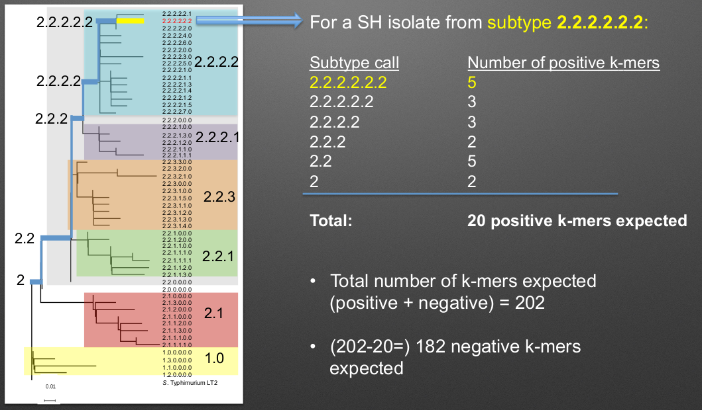
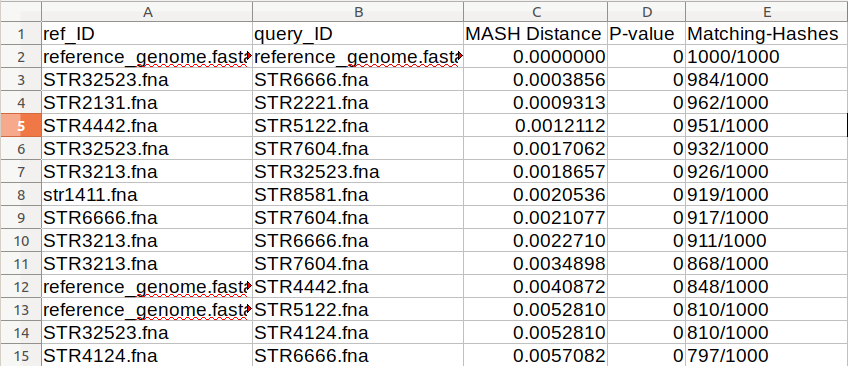
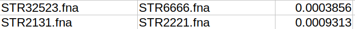
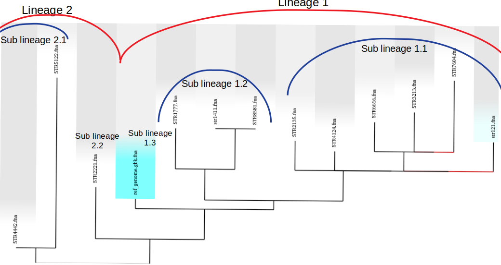
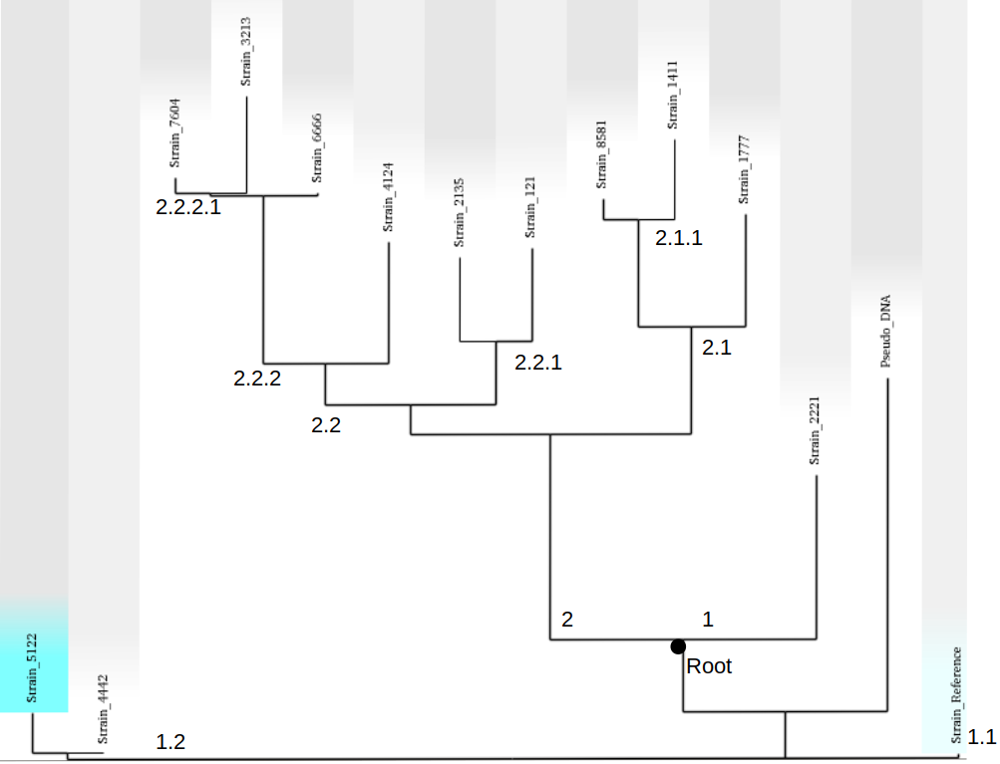

==================
Genotyping Schemes 
==================

.. |parsnp_results| image:: parsnp_results.png
   :alt: results of parsnp analysis
   :width: 600 px

This section will cover the genotyping (**previously called subtyping**) schemes used by biohansel for *Salmonella enterica*
subspecies enterica serovar Heidelberg, Typhi, and Enteritidis. Biohansel also includes a genotyping scheme for
*Mycobacterium tuberculosis*. Along with these 4 schemes included in biohansel, this section will provide you with
in depth information on how to create a custom genotyping scheme.

The genotyping schemes developed and used by biohansel are specifically designed fasta files that contain many k-mer pairs of the same length. 
These k-mer pairs are given a positive or negative label for the genotype that they correspond to allowing analysis to occur through biohansel
to determine what the samples genotype is based on the scheme. If you want to see the exact structure, you can click on
`K-mer_Structure`_ for the exact formatting. k-mers must be formated this way for biohansel to run correctly. 
Depending upon which of these k-mers match the target, the final genotype will be obtained.

The k-mer genotyping process works due to the clonal (very little genomic change/evolution occurs over time) nature of the 
serovars found in *Salmonella enterica* or other clonal pathogens. This clonal nature allows SNPs to be mapped to 
different genotypes that evolved from different lineages over the expanse of a couple of years. *Salmonella* is a good candidate for this type of
genotyping as it is hard to determine a genotype in the lab through conventional means due to all *Salmonella* genotypes being genetically similar.

This process can be used to genotype other clonal pathogens with biohansel as soon as a statistically 
significant genotyping scheme is created and validated for them.  

Heidelberg, Typhi, Typhimurium, and Enteritidis Genotyping Schemes 
------------------------------------------------------------------

The **Heidelberg** genotyping scheme included with biohansel is in version 0.5.0 and features a set of 202 33-mer pairs with a 
single nucleotide polymorphism (SNP) distinguishing between the positive and negative condition in of each pair. 
This distinction between pairs allows for the identification and classification of different genotypes of Heidelberg serovars 
based on the number and location of SNPs in a WGS sample that match to the genotyping schemes pairs. 

The **Enteritidis** scheme (version 1.0.7) features 
a similar set of 317 33-mer pairs that follow the same style as the Heidelberg scheme to classify and identify different 
enteritidis serovar genotypes. It specifies one of 117 genotyoes with its scheme.

The **Typhi** genotyping scheme is a new scheme that follows a similar structure to the other two schemes. It features a classification list 
of 68 k-mers which define 68 genomes. This scheme was adapted by Genevieve Labbe from a publication
by Vanessa Wong et al. titled: `"An extended genotyping framework for Salmonella enterica serovar Typhi, the cause of human typhoid" <https://www.ncbi.nlm.nih.gov/pmc/articles/PMC5059462/>`_.
When running the Typhi scheme, the previous hierarchical codes are automatically appended to the results to allow better comparison.

The **Typhimurium** genotyping scheme (version 0.5.5) is a scheme that features 430 k-mer pairs and follows the same characterisitics of the other schemes above.
This scheme is more robust at detecting SNPs and contamination as it has more k-mers for each genotype leading to it being a more
specific and streamlined scheme. This scheme specifies for 120 different genotypes.

Changes to schemes occur as new classifications are made and then the schemes are updated on GitHub and Galaxy for the use of others.

The Heidelberg, Enteritidis and Typhimurium schemes were developed by Geneviève Labbé et al.

*Mycobacterium tuberculosis* (TB) scheme:
-----------------------------------------
Biohansel now also features a TB scheme developed by Daniel Kein that was adapted from a publication by Francesc Coll et al. titled:
`"A robust SNP barcode for typing Mycobacterium tuberculosis complex strains" <https://www.ncbi.nlm.nih.gov/pmc/articles/PMC4166679/>`_
This scheme currently features a set of 62 33-mers that define 62 different genotypes.

Genotype Classification System
------------------------------

The genotyping classification system created for biohansel follows a nested hierarchical approach to allow relationships between genotypes
to be established based on which SNPs they contain. The format designed for the classification system supports 
modification of the existing genotyping scheme to recognize new branches of new genotypes as they are fit into the 
existing classification system. The designed system works as a way to easily link outbreak origins and look at places 
further up the hierarchy where interventions can be done and monitored based on what genotype was found where. 

The scheme and process that is used to genotype *Salmonella enterica* subspecies Heidelberg can be seen below:

|scheme|

Following the scheme, each positive k-mer match leads to a more specific classification of the genotype with the first matches 
determining which lineage the isolate is from (1 or 2 in this case). After the main lineage is determined, the genotype is 
determined based on all of the matching positive k-mers found in the sample as it follows along the path to the specific genotype. 
It is important that all/most positive and negative k-mers match a spot in the sample to allow correct genotyping and not generate errors!

It is important to note that for a given genomic SNP position defining a lineage, the "positive" k-mer means that the SNP base is present
"inside" the lineage for all of that lineage and nested ones. The "negative" k-mers include the SNP bases present "outside" of that lineage
such that that specific SNP is not found in any of the hierarchical lineages.

The `Output section <output.html>`_ contains more details on the errors that can be run into when running a sample.

Creating a Genotyping Scheme
----------------------------

Creating a statistically valid, representative, and well established genotyping/subtyping scheme for biohansel is a large task. 
Once a scheme is established however, it is easy to modify the scheme to fit the needs of the research and allow for 
new classifications as they are discovered. When creating a genotyping scheme, keep in mind that the **organism should be clonal**. 
All of the k-mers identified and created for the genotyping scheme should be found in all/almost all isolates for biohansel to work correctly.

To create a well constructed genotyping scheme the steps below should be followed. 
However, you do not need to follow the steps to create a genotyping scheme and you can create a quick one to identify certain k-mers 
instead. As long as the k-mer scheme is followed, the k-mers and their locations can be identified using the match_results.tab file. 

Detailed Steps
##############

The detailed steps to create a well structured and accurate genotyping scheme are as follows. 
These steps were used to create the Genotyping Schemes included in biohansel and have been shown to create accurate results 
from the test samples run. The steps are:

1. Generate a large dataset that is representative of the organisms population being defined. For best results make sure to:

- Remove outliers

- Remove poor quality data

- de-duplicate the dataset

2. Choose an available reference genome for the organism (ideally closed). 

3. Subdivide the population into closely related clonal groups using MASH followed by SNP analysis. 
This can be done with any Mash clustering tool. An example used to create the 
included schemes is `Mash version 2 <https://mash.readthedocs.io/en/latest/>`_. 
The SNP analysis can be done with a number of tools including `SNVPhyl <https://snvphyl.readthedocs.io/en/latest/>`_, 
`parsnp <https://github.com/marbl/parsnp>`_, `snippy <https://github.com/tseemann/snippy>`_, or any tool that you prefer.

- Aim for groups that are less than 3000SNPs between strains over more than 80% of the reference genome

|mash_results|

Above is an example of a sorted all against all MASH result based on the matching-hashs column. This result is to see 
which strains are the most closely related and confirm that all of the samples are similar enough to be able grouped together for a scheme.

|parsnp_results|

Above is an example of a SNP analysis using parsnp and Gingr. These tools can be used to visualize a p
hylogenetic tree along with providing a multiple sequence alignment where the SNPs can be easily viewed.   

4. Remove rare outliers from the dataset

- these are detected by SNP matrices, number of unaligned bases, number of heterozygous sites, number of bases with low coverage, etc.

- These rare outliers are from suspected poor quality WGS data, mixed culture samples, or large recombinant regions (phage or transposons).

5. De-duplicate the data once again by removing strains that are nearly identical to each other. This can be defined as:

- Strains that are 0-2 SNPs apart over more then 80% of the reference genome

- Strains that MASH cluster with a distance of ≤ 0.001

|too_similar|

According to the MASH clustering result shown above, we have to pick one of STR32523/STR666 and one of 
STR2131/STR2221 as they are too similar to differentiate properly.

6. Create a Maximum Likelihood (ML) phylogenetic tree from the SNP derived reference assembly of the strains to 
the reference genome. Here you are looking for:

- Regions that are conserved across the whole population of interest such that the SNPs in the areas are found in 99.5% of all isolates

- SNPs that are at least 20 base pairs from other SNPs or indels

	- **The 20 bases on either side of the SNP should be conserved in at least 99.5% of isolates!**

This can be done with any tool that creates a ML phylogeny. Examples of tools previously used include: SNVPhyl, parsnp, 
and `MEGA <https://www.megasoftware.net/webhelp/helpfile.htm#contexthelp_hc/hc_maximum_likelihood_ml_.htm>`_.  

7. Divide the ML tree into main lineages and sub-lineages according to the shape of the tree to allow users to identify
 the main clonal expansions. When doing this make sure that:

- Tree branches are at least 2 SNPs long

	- Longer the branch the better as there will be more SNP positions to choose from for defining that genotype. 
    You can look at a SNP file generated previously to look at the SNPs from regions that don't feature any indels 
    and are isolated by at least 15 (preferably 20) nucleotides on each side.

If wanted, you can lower the number of SNP sites to be evaluated into the scheme by removing all 
of the SNPs that are present in less then 5 isolates and then remaking the tree. The aim is to have at 
least 5-10 strains per sub-lineage, to keep the scheme focused on clonal expansions.

|lineages|

Above is the ML phylogeny previously generated with lineages and sublineages applied to the strains. These are a preliminary 
delegation and can change in the next steps. However, it is a good idea to set up lineages now and edit them as better 
designations are designed.

8. Create a neighbour-joining tree and root it using a distantly related sequence or a pseudo sequence to
 determine where the root of the tree should be.

9. Give main lineages and sub-lineages determined previously hierarchical codes based on how they cluster 
in the NJ tree and the SNPs that make up each sequence.

|proper_subtype|

Based on the SNPs seen in the .vfc file and the rooted tree, hierarchical codes are assigned. 
The root is in an odd spot in this example as it was determined mostly based off of the SNPs seen in the parsnp tree.
It is important to verify that the root is correct with an outgroup as the biohansel scheme needs to be strictly hierarchical.

10. Extract from the SNV table or VCF file the canonical SNPs that define the genotype and differentiate 
it from other strains using `FEHT <https://github.com/chadlaing/feht>`_ which can be installed into bioconda or galaxy. 

The installation instructions are found in the link but if you are using bioconda for biohansel, 
the easiest thing to do is go to the wanted environment and install FEHT there with the following commands:

.. code-block:: bash

    conda activate <name of environment to install feht to>

    conda install -c bioconda feht

FEHT needs the following specific files to run this process:

- A metadata file with the hierarchical codes

- A SNV table or a VCF file that defines the genotype

- The metadata file will be the info file and the VCF file will be the datafile that is needed for Feht to run.

**Make sure that the isolate names match exactly and both files use a tab delimiter**

The metadata file should look as such and be in a **.tsv** format:

+---------------+---------+---------+---------+----------+-----+
| Strain_name   | Level_0 | Level_1 | Level_2 | Level_3  | ... |
+===============+=========+=========+=========+==========+=====+  
| SRR1242421444 | 1       | 1.1     | 1.1.2   | 1.1.2.3  | ... |
+---------------+---------+---------+---------+----------+-----+  
| SRR1242422313 | 2       | 2.2     | 2.2.2   | 2.2.2    | ... |
+---------------+---------+---------+---------+----------+-----+

The VCF table should look as such and also be in a **.tsv** format:

+--------+-----------+---------------+---------------+
|        | reference | SRR1242421444 | SRR1242422313 |
+========+===========+===============+===============+
| 122123 | 0         | 1             | 0             | 
+--------+-----------+---------------+---------------+ 
| 234142 | 0         | 0             | 1             |
+--------+-----------+---------------+---------------+
| 341251 | 0         | 1             | 1             |
+--------+-----------+---------------+---------------+

11. Extract the exact matches to the query using the ratioFilter in FEHT by switching "-f" to "1". 

This is done as the FEHT program performs an all-against-all comparison of all the genotypes, one column 
(one hierarchy) at a time and we only want the exact matches.

12. From this output, we want to extract the genotype against all else results by searching for the ! sign 
(ex. search !2.2 instead of 2.2) and compile these results into a new **.tsv** file with the following information:

+----------+--------------+---------------+---------------+
| Genotype | SNP Location | Positive Base | Negative Base |
+==========+==============+===============+===============+
| 1        | 395          | A             | G             | 
+----------+--------------+---------------+---------------+
| 1        | 2998         | T             | G             | 
+----------+--------------+---------------+---------------+
| 1.1      | 29231        | A             | G             | 
+----------+--------------+---------------+---------------+
| 1.1.1    | 77889        | T             | C             | 
+----------+--------------+---------------+---------------+

The positive base is the base found in the middle of the k-mer and it corresponds to the genotype of the sample. 
The negative base is the base found in all other samples. Both are equally important for the program to function 
properly so it is essential that they are properly defined.

13. Create the genotyping scheme with all of the information obtained. The SNP column shows the exact position 
that the SNP is found in the reference genome. This spot can be made into a 33-mer k-mer used in the scheme by 
recording 16 bases on each side of the SNP such that the SNP is in position 17 of the 33-mer.

A python script can be written to do this such that it creates 33-mers from the reference genome. Keep in mind that most of 
them will be of the negative variety and the positive k-mer pair will need to be created in the next step.

14. Finish the genotyping scheme by making sure that each carefully crafted 33-mer has a positive and negative pair 
attached to the correct genotype. This can be done also using a script (currently being worked on) or the following method:

    1. Paste the 33-mers into the correct location in the FEHT filtered output spreadsheet next to the corresponding SNPs.  

    2. The 33 bp sequences are expanded using TextWrangler (replace [A,T,C,G] by the same base+tab), then pasted back into excel, 
    in 33 adjacent columns.  

    3. Replace the 17th column (middle one) with the positive base column, and collapse the 33 columns into one by 
    removing the tabs in text wrangler.  

    4. Paste back into Excel as the list of “positive k-mers”.  

    5. Replace the middle column by the negative base column and repeat the same procedure to obtain the list of “negative k-mers”.

15. Create a FASTA file following the K-mer structure found below. Make sure that the headers and sequences are on 
separate lines. The order of the files in the scheme does not matter for biohansel input.

It is important that the K-mers follow the exact format or the analysis will generate errors and potentially fail. 
They should all be the same size with position 17 (or the middle position if using a smaller k-mer size) containing the SNP.

K-mer_Structure
###############

The structure k-mer pairs are structured as such and must follow the following format to work correctly:

| **For the Positive k-mers:**
|
| >[SNP position in ref genome]-[genotype]
| AAATTTCAGCTAGCTA\ **G**\ CTAGCAATCACTGATC
| 
| **For the Negative k-mers:**
| 
| >negative[SNP position in ref genome]-[genotype]
| AAATTTCAGCTAGCTA\ **T**\ CTAGCAATCACTGATC

An example with real data:

| >2981-2.2.3.1.4
| ACTGCCGCCGGAGCCG\ **T**\ GTGAAAATATTGTTTA
| 
| >negative2981-2.2.3.1.4
| ACTGCCGCCGGAGCCG\ **C**\ GTGAAAATATTGTTTA

***The first distinction between genotypes 1 and 2 (or potentially more genotypes) does not have a negative condition 
and instead moves samples into one of the two classes established. The setup for the k-mers is similar to the other 
k-mers shown above and looks like such:

| >717-1
| ATGCAGAGTCAGTCAG\ **A**\ TCAACATGCACCCACA
| 
| >717-2
| ATGCAGAGTCAGTCAG\ **T**\ TCAACATGCACCCACA

16. Test the created scheme by running biohansel to verify that all of the expected positive target sequences are present in the corresponding strains. Eliminate targeted k-mers from the scheme that do not work well and verify that the targeted k-mers created are present in most of the dataset. Finally test the scheme on a de novo assembly along with raw Illumina sequencing reads to make sure it holds true for both.
