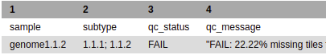
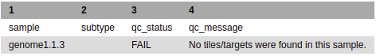
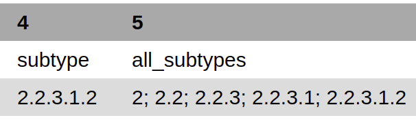
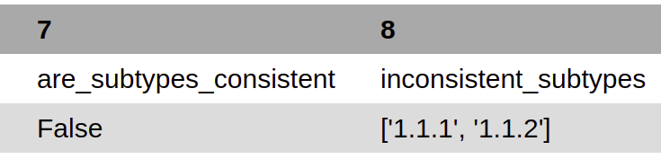
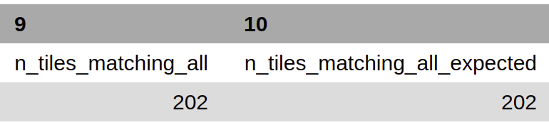
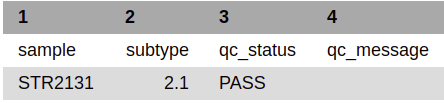

======
Output 
======

This page describes the three different result files will be produced from running biohansel: `tech results.tab`_, `match results.tab`_ & `results.tab`_. The results found in these three files will be the same whether you are using the command line or Galaxy to run an analysis.

.. |mixed| image:: https://raw.githubusercontent.com/phac-nml/biohansel/readthedocs/docs/source/user-docs/Mixed.PNG
   :width: 100 px
   :alt: Example of Mixed targets
   
   
.. |missing| image:: https://raw.githubusercontent.com/phac-nml/biohansel/readthedocs/docs/source/user-docs/Missing%20Targets.PNG
   :width: 100 px
   :alt: Example of Missing Targets
   
.. |inconsistent| image:: https://raw.githubusercontent.com/phac-nml/biohansel/readthedocs/docs/source/user-docs/Inconsistent%20results.PNG
   :width: 100 px
   :alt: Example of Inconsistent results
   
.. |unconfident| image:: https://raw.githubusercontent.com/phac-nml/biohansel/readthedocs/docs/source/user-docs/Unconfident%20(1).PNG
   :width: 100 px
   :alt: Example of Unconfident results
   
.. |pass| image:: https://raw.githubusercontent.com/phac-nml/biohansel/readthedocs/docs/source/user-docs/Pass.PNG
   :alt: This is an ideal picture of a passed scheme
   :width: 100 px

.. |positive| image:: https://raw.githubusercontent.com/phac-nml/biohansel/readthedocs/docs/source/user-docs/Positive%20pic%20of%20matching.PNG
   :alt: picture of positive match
   :width: 100 px

.. |consistent| image:: https://raw.githubusercontent.com/phac-nml/biohansel/readthedocs/docs/source/user-docs/PCIS%20BIO.PNG
   :alt: picture of consistent
   :width: 100 px

.. |n_all| image:: https://raw.githubusercontent.com/phac-nml/biohansel/readthedocs/docs/source/user-docs/N%20tiles%20all%20picture.PNG
   :alt: picture of all match
   :width: 100 px
 
.. |subtype| image:: https://raw.githubusercontent.com/phac-nml/biohansel/readthedocs/docs/source/user-docs/sUBTYPE%20MATCH%20PIC.PNG
   :alt: picture of subtype match
   :width: 100 px

|
**Tech Results.tab**
####################

Structure:
----------

Tech_results.tab is the simplest output file released by running a biohansel analysis. 
It contains only the sample name, genotype, and the QC status of the sample allowing this 
file to be easy to interpret at the cost of not elaborating on any of the specific details of the analysis. 
Found below are the columns and explanations of the columns for this output file:

+---------------+---------------------------------+--------------------------------------------+---------------------+----------------------------+ 
| Sample        | Genotype                        | Avg_kmer_coverage*                         | QC_status           | QC_message                 |
+---------------+---------------------------------+--------------------------------------------+---------------------+----------------------------+
| (Sample Name) | (Corresponding Genotypes Found) | (average k-mer coverage of all the targets | (PASS/FAIL/WARNING) | (Corresponding QC message) |
+---------------+---------------------------------+--------------------------------------------+---------------------+----------------------------+
*Average_kmer_coverage is only found in the output when analyzing fastq files or directories with fastq files.

Sample
""""""
This column provides the names of samples that were run on biohansel

Genotype
""""""""
This column gives the genotype/subtype of the sample determined by the analysis. This column can display a single positive genotype, 
a list of positive genotypes, or no genotype depending on the results of the analysis. A good analysis will output the following:

|good_tech|

If this column does not display a single positive genotype, it will show one of the two following situations:

1. Different genotypes if mixed samples are run or there is an error in a user-created scheme.
In this case, biohansel will list all different genotypes detected.

|mixed_result|

2. If no positive target is detected, the column will be blank and the qc_message will state that no k-mers/targets were found.

|error_no_result|

Average K-mer Coverage
""""""""""""""""""""""
Displays the average coverage of all of the targets/k-mers that were present in the sample.

QC Columns
""""""""""
QC Status and QC message are found in full details under their own section as they are a part of all 3 output files. 
This detailed information is found in the `Quality_Control`_ section.

**Match Results.tab**
#####################

**Fasta File Output Structure:**
--------------------------------

The following is the scheme for the match_results.tab file **For a single Fasta file**. 
**Running raw reads data has slightly different output columns due to the different nature of the data**. 
The output columns for the match_results.tab file are shown below broken into different charts to allow them 
to fit mostly on one page. In the real generated file, they would all found in the same long row. Below, you will 
find detailed information for each column.

+------------------------+--------------------------------+--------------+------------------+------------------+-------------------------------+--------------------------+--------------+---------------+-----------------+---------------+------------------+---------------------+----------------------------+  
| kmername               | Sequence                       | is_revcomp   | Contig_id        | Match_index      | Refposition                   | Genotype                 | is_pos_kmer  | Sample        | File_path       | Scheme        | Scheme_version   | QC_Status           | QC_message                 |
+------------------------+--------------------------------+--------------+------------------+------------------+-------------------------------+--------------------------+--------------+---------------+-----------------+---------------+------------------+---------------------+----------------------------+
| (Name of Target/K-mer) | (Corresponding K-mer Sequence) | (TRUE/FALSE) | (Name of Contig) | (Match Position) | (Match Position in reference) | (Genotypes in kmername)  | (TRUE/FALSE) | (Sample Name) | (File Location) | (Scheme Name) | (Scheme Version) | (PASS/FAIL/WARNING) | (Corresponding QC message) |
+------------------------+--------------------------------+--------------+------------------+------------------+-------------------------------+--------------------------+--------------+---------------+-----------------+---------------+------------------+---------------------+----------------------------+

**Raw Reads FastQ File Output Structure:**
------------------------------------------

Running raw reads files/FastQ files gives slightly different output columns when compared to the Fasta file match_results.tab 
output due to the slight differences in the data that each file contains. The overall output for a match_results.tab results output 
from a FastQ file looks as such:

+------------------------+--------------------------------+---------------------------------+-------------------------------+--------------------------+--------------+-------------------+-----------------+---------------+---------------+------------------+---------------------+----------------------------+  
| kmername               | Sequence                       | Frequency                       | Refposition                   | Genotype                 | is_pos_kmer  | is_kmer_freq_okay | File_path       | Sample        |Scheme         | Scheme_version   | QC_Status           | QC_message                 |
+------------------------+--------------------------------+---------------------------------+-------------------------------+--------------------------+--------------+-------------------+-----------------+---------------+---------------+------------------+---------------------+----------------------------+  
| (Name of Target/K-mer) | (Corresponding K-mer Sequence) | (Number of exact matches found) | (Match Position in reference) | (Genotypes in kmername)  | (TRUE/FALSE) | (TRUE/FALSE)      | (File Location) | (Sample Name) |(Scheme Name)  | (Scheme Version) | (PASS/FAIL/WARNING) | (Corresponding QC message) |
+------------------------+--------------------------------+---------------------------------+-------------------------------+--------------------------+--------------+-------------------+-----------------+---------------+---------------+------------------+---------------------+----------------------------+

**Detailed Column Information** 
-------------------------------

The detailed information on the meaning of each columns outputs for both files can be found below:

Kmername
""""""""
This column gives the name of the target/k-mer that matched to the sample. It will match to the name of the k-mer in the fasta file 
following the fasta convention as seen in the `input section <input.html>`_. The k-mers that match the sample give the genotype of the sample

Sequence
""""""""
The column contains the sequence of the k-mer from the kmername column. This sequence is the 33 bp 
fragment that matched somewhere in the sample.

is_revcomp
""""""""""
Is the k-mer found in the forward direction or the reverse direction?

1. FALSE - the target k-mer was found from the 5' to 3' direction 

2. TRUE - the target k-mer was found in the 3' to 5' direction in the sample

Contig_id
"""""""""
Displays the name of the contig as found in the Fasta file.

Frequency
"""""""""
Displays the exact number of matches found for the k-mer in the raw reads/FastQ file input.

Match_index
"""""""""""
Displays the last nucleotide match of a k-mer as its position in the genome.

For example, if the k-mer matched the genome from positions 12312 to 12345, the SNP would be at position 12329 
and output of this column would be 12345.

Refposition
"""""""""""
Displays the numerical position of the k-mer/k-mers SNP in the reference genome. This information is also found in the 
description of the k-mer in the genotyping schemes Fasta file. 

Genotype
""""""""
Shows the consensus genotype of the sample as determined by the analysis. 

This column can display a single positive genotype, a list of positive genotypes, or no genotype depending on the results.

is_pos_kmer
"""""""""""
Is the k-mer in question a positive k-mer/target for specific genotype?

1. TRUE - the positive SNP has been found in the sample

2. FALSE - the negative SNP has been found in the sample

is_kmer_freq_okay
"""""""""""""""""
Is the frequencey of the k-mer/target within the specified QC parameters (min/max)? For FastQ datasets. 

1. TRUE - enough of the k-mer has been found in the dataset as specified by the QC parameters

2. FALSE - not enough of the k-mer has been found in the dataset as specified by the QC parameters

File path
"""""""""
The location of the input data file/files.

Scheme
""""""
The name of the chosen scheme used in the analysis.

Scheme_vers
"""""""""""
The version of the chosen scheme used in the analysis.

QC Columns
""""""""""
QC Status and QC message are found in full details under their own section as they are a part of all 3 results files. 
This detailed information is found in the `Quality_Control`_ section.

|
**Results.tab**
################

Structure:
----------

The results.tab output file is almost exactly the same for all inputs. This file contains the overall 
information of the analysis and gives the final results of a biohansel run in more detail then the tech_results.tab file. 
The expanded version of all information that can be obtained from this file is as such:

+---------------+---------------+---------------------+-------------------------+-----------------------------+-------------------------------------+--------------------------+------------------------+--------------------------------------+---------------------------------------+-----------------------------------------+-----------------------------------------+--------------------------------------------+-------------------------------------------+-----------------+-----------------------------------+---------------------+---------------------------+
| Sample        | Sequence      | Scheme_vers         | Genotype                | all_genotypes               | kmers_matching_genotype             | are_genotypes_consistent | inconsistent_genotypes | n_kmers_matching_all                 | n_kmers_matching_all_expected         | n_kmers_matching_positive               | n_kmers_matching_positive_expected      | n_kmers_matching_genotype                  | n_kmers_matching_genotype_expected        | File path       | avg_kmer_coverage                 | QC status           | QC message                | 
+---------------+---------------+---------------------+-------------------------+-----------------------------+-------------------------------------+--------------------------+------------------------+--------------------------------------+---------------------------------------+-----------------------------------------+-----------------------------------------+--------------------------------------------+-------------------------------------------+-----------------+-----------------------------------+---------------------+---------------------------+ 
| (Sample Name) | (Scheme name) | (Version of Scheme) | (Genotypes in kmername) | (Genotypes in all lineages) | (genotypes that match given k-mers) | (TRUE/FALSE)             | (TRUE/FALSE)           | (Number of actual matches in sample) | (Expected positive matches in sample) | (Number of matches in targeted lineage) |  (Expected matches in targeted lineage) | (Number of matches in specific sublineage) | (Expected matches in targeted sublineage) | (File Location) | (Average frequency of all k-mers) | (PASS/FAIL/WARNING) | Corresponding QC message) |
+---------------+---------------+---------------------+-------------------------+-----------------------------+-------------------------------------+--------------------------+------------------------+--------------------------------------+---------------------------------------+-----------------------------------------+-----------------------------------------+--------------------------------------------+-------------------------------------------+-----------------+-----------------------------------+---------------------+---------------------------+

Sample
""""""
Provides the names of samples that were run on biohansel

Scheme
""""""
The name of the chosen Scheme used in the analysis.

Scheme_Version
""""""""""""""
The version of the chosen scheme used in the analysis.

Genotype
""""""""
Shows the consensus genotype of the sample as determined by the analysis.

This column can display a single positive genotype, a list of positive genotypes, or no genotype depending on the results.

All_genotypes
"""""""""""""
All of the genotypes in all the levels of lineage leading to the final genotype.

|all_subtypes|

kmers_matching_genotype
"""""""""""""""""""""""
Displays the genotype(s) that the most downstream, specific k-mers have matched to. For good, non-mixed results, it should be the 
same as the genotype column.

are_genotypes_consistent
""""""""""""""""""""""""
1. TRUE - the genotypes are consistent as defined.

- Consistency -> All positive k-mers within QC parameters have consistent genotypes in downstream sublineages corresponding to parent genotype.

|consistent|

Each k-mer must become more specific to the final genotype while matching all of the previous ones to be considered consistent.

2. FALSE - the genotypes are not consistent.

inconsistent_genotypes
""""""""""""""""""""""
If "are_genotypes_consistent" is FALSE, it lists genotypes that are inconsistent to parent.

|inconsistent_subtypes_false|

n_kmers_matching_all
""""""""""""""""""""
Counting all of the actual k-mer matches (both positive and negative) that make up each genotype lineage as defined by 
the genotyping scheme used/created.

|n_all|

n_kmers_matching_all_expected
"""""""""""""""""""""""""""""
The total number k-mer/target matches expected (both positive and negative) that make up each genotype lineage as defined 
by the genotyping scheme used/created.

Every/almost every k-mer defined in the scheme should match somewhere in the sample if the sample is of high quality.

|matching_all|

n_kmers_matching_positive
"""""""""""""""""""""""""
The number of positive matches in the sample from all of the upstream lineages of the output genotype as defined by the genotyping scheme.

|positive|

n_kmers_matching_positive_expected
""""""""""""""""""""""""""""""""""
The expected number of positive matches from all of the upstream lineages of the output genotype as defined by the genotyping scheme.

For a good analysis, this value should match the sample.

n_kmers_matching_genotype
"""""""""""""""""""""""""
The number of positive matches in the sample sublineage only.

|subtype|

n_kmers_matching_genotype_expected
""""""""""""""""""""""""""""""""""
The expected number of positive matches in the sample sublineage only.

File Path
"""""""""
The file location of the input data.

Avg_kmer_coverage
"""""""""""""""""
The average frequency of all k-mers, both positive and negative, that were found in the sample. This output column is 
only found for analysis of raw reads FastQ files and it is an indicator that there was a sufficient amount of overlap 
in the dataset for the results to be significant. 

QC Columns
""""""""""
QC Status and QC message are found in full details under their own section as they are a part of all 3 results files. 
This detailed information is found in the `Quality_Control`_ section.

**Quality_Control**
###################

|
**QC Status**
-------------
Three possibilities can be shown in this column based on the QC analysis described below: `QC message`_

1. PASS

2. FAIL

3. WARNING

|
**QC message**
--------------
The QC message displayed provides information on what happened in the analysis and where, if there was a warning or fail, 
the data can be cleaned up/improved to obtain a passing result. 

*"Pass"*
"""""""""
A pass occurs when there is no errors in the targeted lineage and its corresponding sublineages:

|pass|

Once the QC module is declared as a pass, there is no information in the QC message column displayed. 
The result should be considered a valid analysis.

|
*"WARNING: Intermediate Genotype"*
""""""""""""""""""""""""""""""""""
Warnings will be triggered if all four following conditions are met:
   
**1st condition:** Less than 5% of the k-mers are missing (by default) or more than 95% of the schemes targets are matched 
(parameters for this is adjustable prior to running biohansel)

**2nd condition:** There should be no clash for "+" and "-" targets for the same genome position (above background noise level)
   
**3rd condition:** Only a fraction of the k-mers are positive for the final genotype 
("# of k-mers matching genotype expected > # of k-mers matching genotype") 
   
**4th condition:** The targets for the final subtype are a mixture of both "+" and "-" BUT do NOT clash for the same positions.

|
*"WARNING: Low Coverage"*
"""""""""""""""""""""""""
If the "Avg k-mer Coverage" is below the parameters given for low coverage (parameters are adjustable) (default min average coverage: 20- fold)

Average coverage calculated from all targets found in the sample (The value is returned to the user)

|
*Error Type 1: Missing kmers*
"""""""""""""""""""""""""""""
\*** The Maximum amount of missing k-mers, either positive or negative, to be allowed before being considered an error/fail. 
This amount can be edited based on preference and scheme.

Three possible causes:

1. Bacterial scheme does not match target                                       

2. Low genome coverage or low quality data

3. Range of target coverage extends outside of QC limits (k-mer frequency thresholds default = min:8, max:500)

** To determine which cause, the average coverage depth is returned to the user. The value is calculated based on the 
coverage for all k-mers that were above the minumum coverage threshold (indicated by the QC parameters: default value = 8) 

|missing|

|
*Error Type 2: Mixed Sample*
""""""""""""""""""""""""""""
A mixed sample error is where biohansel is unsure what the final genotype is of the sample due to one of two possible causes:

1. biohansel came out with an "inconsistent result" designation

2. Position conflict: both "+" and "-" targets are found in the same target genome position above background noise level

A possible solution to this error if the average genome coverage is above 100 is to increase the minimum k-mer threshold to at least 
10% of the average genome coverage. This will change the background noise tolerated and potentially allow for a positive result to occur. 

|mixed|

|
*"Error Type 3: Ambiguous result"* 
""""""""""""""""""""""""""""""""""
Caused by both conditions met:

1. Total matching k-mers is within 5% of the expected value

2. 3 or more k-mers are missing for the final genotype call (Error 3a)

|inconsistent|

|
*"Error Type 4: Unconfident/Not confident result"*
""""""""""""""""""""""""""""""""""""""""""""""""""
Lineage call is uncertain due to missing targets in downstream sublineage.

|unconfident|

.. _schemes: genotyping_schemes.html

