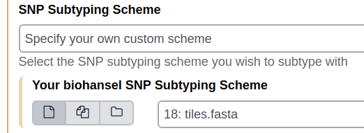
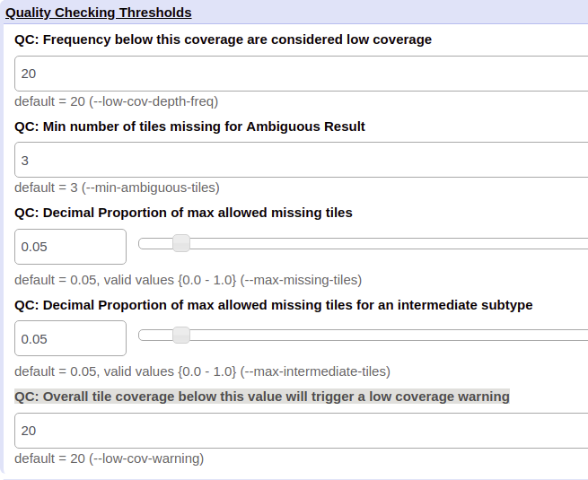
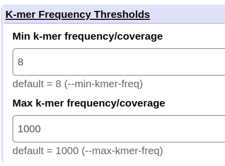

Parameters
==========

This section will explain how to use the Galaxy parameters of biohansel to get the most out of your analyses. The command line is slightly more complicated then Galaxy but also allows more a bit more customization to it. The command line arguments and parameters that can be changed can be found in the `Command-Line section <command-line.html>`_.

Galaxy Parameters
-----------------

These are the parameters and their functions using Galaxy. Each of the headers is the name of the section on Galaxy where the underlying parameters can be changed. 

Sequence Data Type
##################

The sequence data type settings in Galaxy allow the user to choose what type of file the analysis will be run on. Picking a file type listed in the subsections below will give a few additional options. These options relate to how many files are being analyzed at once and how the data is output. A single file or multiple files can be run with one execute command. The types of jobs that can be run include:

1. A single fasta/fastq file

2. Multiple fasta/fastq files to be analyzed separately

3. A dataset collection of fasta/fastq files that will generate a single output file

Remember that unlike the command line, you cannot run different file type analyses at once with a single run in Galaxy. Paired-end reads do not have these additional options.

This section must have a file and a file type chosen to run an analysis.

Contigs (FASTA)
"""""""""""""""

When the contigs type of sequence data is chosen, Galaxy allows an input of any fasta file currently in the history being worked from.

Paired-end reads (FASTQ)
""""""""""""""""""""""""

If the paired-end reads data type is selected, two fastq files are needed as input for an analysis to be run. These must have ASCII encoded quality scores. Additionally, the forward and reverse file formats must match.

Single-end reads (FASTQ)
""""""""""""""""""""""""

If single-end reads is selected, a single fastq file is required as input

Paired-end reads collection (FASTQ)
"""""""""""""""""""""""""""""""""""

With a paired-end reads collection, you can only select that as the input to run biohansel on.

SNP Subtyping Scheme
####################

Under this heading, select the subtyping scheme that corresponds to the sample type that you are running. If you are running a Heidelberg sample then you would select "Salmonella Heidelberg subtyping scheme" from the drop down menu. A scheme is necessary for a run and if none is selected, there is no run.

If you select the "specify your own custom scheme", you will need to input the tiles for the scheme you have created as a fasta file. You can also input multiple developed schemes to run on the input data selected in the Sequence Data Type section. To do this, click on the small tiles below where it says "Your biohansel SNP Subtyping Scheme".

|tiles|

Scheme Subtype Metadata Table (Optional)
########################################

The Scheme Subtype Metadata Table is an optional input that adds more details to the results files. It can be left blank or a .tsv or .csv file containing a column called subtype can be added in here. Multiple metadata tables can be added and linked to multiple analyses or a collection of them can be added so that they come out in a single output file.

K-mer Frequency Thresholds
##########################

The parameters found under this column are only needed when running results on raw read fastq files. They control how much k-mer is needed to be considered acceptable for an analysis. 

Min k-mer frequency/coverage
""""""""""""""""""""""""""""

The minimum frequency that all of the k-mers of the chosen subtyping scheme should be found in a raw reads Fastq dataset. If a k-mer falls below this coverage, it will not be taken into account in the results.

This parameter should be adjusted based on the average genome coverage of the dataset (or estimated average tile coverage output by biohansel). A good min k-mer coverage would be 10% of your estimated genome/tile coverage.

Max k-mer frequency/coverage
""""""""""""""""""""""""""""

The maximum frequency that all of the k-mers of the chosen subtyping scheme should be found in a raw reads Fastq dataset. If a k-mer is above this chosen frequency, it will not be taken into account. Default is 1000. Make sure that the Max k-mer frequency is at least 5x more then the average genome coverage of the dataset (or estimated average tile coverage output by biohansel).

|k-mer_freq|

Quality Checking Thresholds
###########################

These parameters are used to run the quality control (QC) module that determines if the outcome of biohansel is a PASS or a FAIL. Changing them allows for greater control on what the program will allow a pass, whether this is more strict or less strict. 

|QC_Thresh|

QC: Frequency below this coverage are considered low coverage
"""""""""""""""""""""""""""""""""""""""""""""""""""""""""""""

This QC threshold determines if the coverage of each of the individual tiles is enough to be considered adequate or low coverage. The lower this value is set, the more lax what is considered low coverage is for QC module warning. The default value is 20. This parameter may be useful for scheme development.

QC: Min number of tiles missing for Ambiguous Result
""""""""""""""""""""""""""""""""""""""""""""""""""""

This QC threshold determines the minimum number of positive tiles that can be missed to result in an ambiguous output by biohansel. The default value is 3. A higher value means that the QC module is more relaxed resulting in less ambiguous results from datasets that are not as highly covered. 

QC: Decimal Proportion of max allowed missing tiles
"""""""""""""""""""""""""""""""""""""""""""""""""""

This QC threshold determines the maximum number of tiles allowed to be missing in the target dataset as a decimal proportion before the QC module determines the outcome to be a failure. The default decimal proportion is 0.05 or 5%. 

QC: Decimal Proportion of max allowed missing tiles for an intermediate subtype
"""""""""""""""""""""""""""""""""""""""""""""""""""""""""""""""""""""""""""""""

This QC threshold determines the maximum number of tiles allowed to be missed in the target dataset as a decimal proportion before the QC module determines that the outcome is a failure due to being an intermediate subtype. The default decimal proportion is 0.05 which equals 5%. 

QC: Overall tile coverage below this value will trigger a low coverage warning
""""""""""""""""""""""""""""""""""""""""""""""""""""""""""""""""""""""""""""""

This QC threshold is the average tile Coverage of an analyzed fastq file which, when the average coverage falls below this number, a warning is triggered by the QC module saying that the sample is of low coverage. The default is 20. A lower number will relax the standard and allow sample of lower quantity to pass which may be needed on metagenomic samples. Doesn't affect the validity of the biohansel results.

**This is meant as a warning that you may want to resequence your sample for more data for other downstream applications.**

Developer Options
#################

There is only one developer option available and it is to output JSON files on top of the normal analysis files. If this option is set to "yes", there will be six output files, three JSON files and three .tab files. The JSON files are used to represent analysis details that are not found in the normal files.

